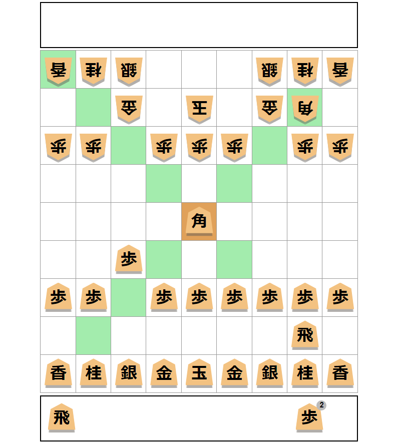

# Aprendendo React

Projeto divertido para aprender React



## Objetivos

* 1º - Aprender react
* 2º - Criar o Jogo de Shogi Offline pessoa X pessoa
* 3º - Criar opção de jogar Online pessoa X pessoa
* 4º - Criar opção de jogar pessoa X IA

## Inicializar o projeto

Este projeto esta utilizando a porta http 3000 como padrão
```sh
npm start
```
